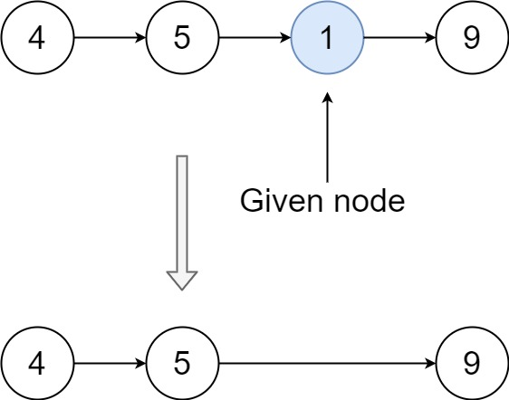

## Algorithm

本周的算法题是 [Delete Node in a Linked List](https://leetcode.com/problems/delete-node-in-a-linked-list/)

### **Rule**

Write a function to **delete a node** in a singly-linked list. You will **not** be given access to the `head` of the list, instead you will be given access to **the node to be deleted** directly.

It is **guaranteed** that the node to be deleted is **not a tail node** in the list.

**Example 1:**


```
Input: head = [4,5,1,9], node = 5
Output: [4,1,9]
Explanation: You are given the second node with value 5, the linked list should become 4 -> 1 -> 9 after calling your function.
```

**Example 2:**



```
Input: head = [4,5,1,9], node = 1
Output: [4,5,9]
Explanation: You are given the third node with value 1, the linked list should become 4 -> 5 -> 9 after calling your function.
```

**Example 3:**

```
Input: head = [1,2,3,4], node = 3
Output: [1,2,4]
```

**Example 4:**

```
Input: head = [0,1], node = 0
Output: [1]
```

**Example 5:**

```
Input: head = [-3,5,-99], node = -3
Output: [5,-99]
```

**Constraints:**

- The number of the nodes in the given list is in the range `[2, 1000]`.
- `-1000 <= Node.val <= 1000`
- The value of each node in the list is **unique**.
- The `node` to be deleted is **in the list** and is **not a tail** node

### **Solution**

```java
class Solution {
    public void deleteNode(ListNode node) {
        // copy the next node value        
        node.val = node.next.val;
        // delete next node
        node.next = node.next.next;
    }
}
```

## Review

 消除重复，追求clean code就一定是对的吗？不一定，**技术考虑**，**项目管理**等因素都很重要。

上周，前同事T离职，我接手他的项目。阅读代码的时候发现，T写了不少反模式的代码，例如：职责相同的代码散落在不同的类中，一次性代码比例很大（无法复用），命名很随意：面向具体需求命名而非面向业务模型命名（[不要面向需求编程](http://blog.itpub.net/31559354/viewspace-2740217/)）。

于是我尝试重构这部分代码，暂未向leader报告。时间过去了2天，重构了50%的任务量，但此时我是改的无比的没有底气，越改越没自信，意识到风险很大（项目已经上线），于是向leader反馈了这件事情，leader建议：回滚已经重构的部分；同时为了后期的维护方便，在功能冗余的一个类中声明：新的特性将写在最新的类中，既有代码暂保持原状。事实上，这部分代码最大的问题是**结构混乱**，但业务功能能跑通。因为项目已经上线，并且重构的理由不充分，重构的风险较大，成本较高，鉴于技术考虑和项目进度管理这是最佳处理方案了。


## Tip

[如何写好业务代码](https://www.zhihu.com/question/60761181)

## Share

初学者，对于行业内的东西不清楚，很容易抓不住重点，迷失学习的方向。

**立足岗位，多听多思考**是个卓有成效的方法。对于Java程序员来说，以下主题都是重点

- 缓存
- 异步
- 事务
- 业界标准或最佳实践
- OO能力
- 建模能力
- 抽象思维，结构化思维

**做正确的事**和**正确的做事**是一个关键的原则。每周再忙，花时间琢磨、确定哪些事是**值得做**的大有裨益，同时制定重要事情的日程*dealLine*，不时的检视。

