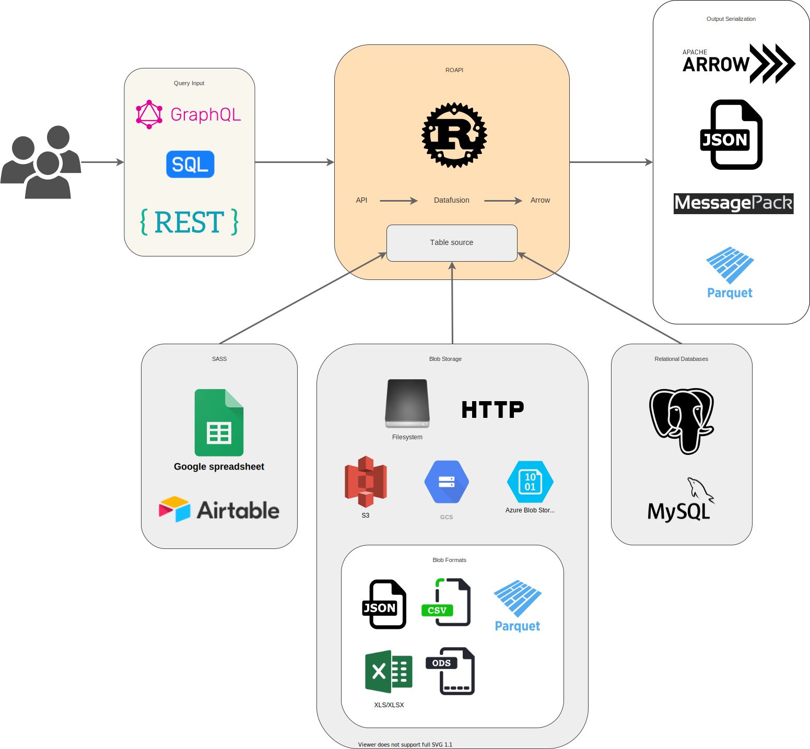

## Algorithm

本周的算法题是  [Course Schedule II](https://leetcode.com/problems/course-schedule-ii/)

### **Rule**

There are a total of `numCourses` courses you have to take, labeled from `0` to `numCourses - 1`. You are given an array `prerequisites` where `prerequisites[i] = [ai, bi]` indicates that you **must** take course `bi` first if you want to take course `ai`.

- For example, the pair `[0, 1]`, indicates that to take course `0` you have to first take course `1`.

Return *the ordering of courses you should take to finish all courses*. If there are many valid answers, return **any** of them. If it is impossible to finish all courses, return **an empty array**.

 

**Example 1:**

```
Input: numCourses = 2, prerequisites = [[1,0]]
Output: [0,1]
Explanation: There are a total of 2 courses to take. To take course 1 you should have finished course 0. So the correct course order is [0,1].
```

**Example 2:**

```
Input: numCourses = 4, prerequisites = [[1,0],[2,0],[3,1],[3,2]]
Output: [0,2,1,3]
Explanation: There are a total of 4 courses to take. To take course 3 you should have finished both courses 1 and 2. Both courses 1 and 2 should be taken after you finished course 0.
So one correct course order is [0,1,2,3]. Another correct ordering is [0,2,1,3].
```

**Example 3:**

```
Input: numCourses = 1, prerequisites = []
Output: [0]
```

 

**Constraints:**

- `1 <= numCourses <= 2000`
- `0 <= prerequisites.length <= numCourses * (numCourses - 1)`
- `prerequisites[i].length == 2`
- `0 <= ai, bi < numCourses`
- `ai != bi`
- All the pairs `[ai, bi]` are **distinct**.

### **Solution**

```java
class Solution {
    public int[] findOrder(int numCourses, int[][] prerequisites) {
        if (numCourses <= 0) {
            return new int[0];
        }

        HashSet<Integer>[] adj = new HashSet[numCourses];
        for (int i = 0; i < numCourses; i++) {
            adj[i] = new HashSet<>();
        }

        // [1,0] 0 -> 1
        int[] inDegree = new int[numCourses];
        for (int[] p : prerequisites) {
            adj[p[1]].add(p[0]);
            inDegree[p[0]]++;
        }

        Queue<Integer> queue = new LinkedList<>();
        for (int i = 0; i < numCourses; i++) {
            if (inDegree[i] == 0) {
                queue.offer(i);
            }
        }

        int[] res = new int[numCourses];
        // 当前结果集列表里的元素个数，正好可以作为下标
        int count = 0;

        while (!queue.isEmpty()) {
            // 当前入度为 0 的结点
            Integer head = queue.poll();
            res[count] = head;
            count++;

            Set<Integer> successors = adj[head];
            for (Integer nextCourse : successors) {
                inDegree[nextCourse]--;
                // 马上检测该结点的入度是否为 0，如果为 0，马上加入队列
                if (inDegree[nextCourse] == 0) {
                    queue.offer(nextCourse);
                }
            }
        }
        
        // 如果结果集中的数量不等于结点的数量，就不能完成课程任务，这一点是拓扑排序的结论
        if (count == numCourses) {
            return res;
        }
        return new int[0];
    }

}
```

本题是**拓扑排序**的典型例子，solution来自 [网友A](https://leetcode-cn.com/problems/course-schedule-ii/solution/tuo-bu-pai-xu-shen-du-you-xian-bian-li-python-dai-/)

## Review

[ ROAPI](https://github.com/roapi/roapi) 是一个简化**静态数据集查询**难度的开源项目，用户可以通过sql语句，Restul 查询，GraphQL 3种方式 获取到数据，而不需要写一行代码，另外 [ROAPI: An API Server for Static Datasets](https://tech.marksblogg.com/roapi-rust-data-api.html) 可以当教程使用。

作者使用Rust语言仅用了4K行代码完成了该项目，合理依赖第三方库 [Apache Arrow](https://github.com/apache/arrow) and [Datafusion](https://github.com/apache/arrow-datafusion) 是成功的关键。




## Tip

优化慢sql的几点体会

1. EXPLAIN + sql 查看执行计划
2. 子查询、in 过滤，一般可以用`join`来改写
3. 带Group By 的sql 在count(0) 时效率很低
4. 建立sql查询时间数量级概念。比如，10w数据查询时间3s，那么优化sql时，10%即0.3s就应该敏感起来，不应该大大咧咧，优化没有什么效果，这种模糊的回答。

## Share

[差不多先生传（胡适）](https://www.skhsbs.edu.hk/chi/ref/Artical/166.htm)


